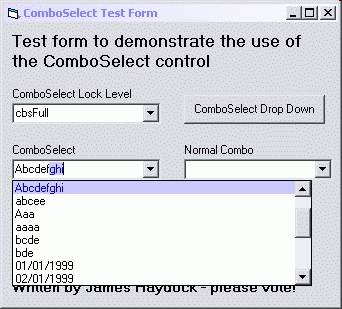



## An Enhanced Combobox

### Description

Enhanced combobox with various levels of Auto complete (including Access style), Auto drop down, settable dropdown width, and an easier coding interface.
 
### More Info
 
The usercontrol uses a hooking library. It is unadvisable to step through the code within this module unless you know what you are doing.

             |
---                |---
**Submitted On**   |2003-01-14 16:48:46
**By**             |[James Haydock](https://github.com/Planet-Source-Code/PSCIndex/blob/master/ByAuthor/james-haydock.md)
**Level**          |Advanced
**User Rating**    |4.2 (72 globes from 17 users)
**Compatibility**  |VB 5\.0, VB 6\.0
**Category**       |[Custom Controls/ Forms/  Menus](https://github.com/Planet-Source-Code/PSCIndex/blob/master/ByCategory/custom-controls-forms-menus__1-4.md)
**World**          |[Visual Basic](https://github.com/Planet-Source-Code/PSCIndex/blob/master/ByWorld/visual-basic.md)
**Archive File**   |[An\_Enhance1529451152003\.zip](https://github.com/Planet-Source-Code/james-haydock-an-enhanced-combobox__1-42444/archive/master.zip)

### API Declarations

CallWindowProc, SetWindowLong, GetWindow, GetComboBoxInfo, SendMessage, GetCursorPos, ScreenToClient, ClientToScreen

